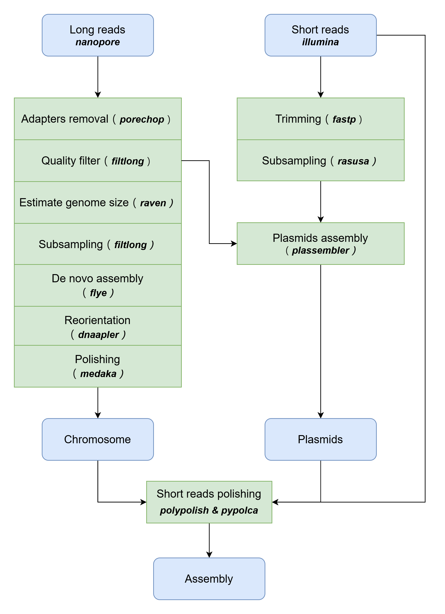

<p align="center"></p>
<p align="center"><a href="https://www.flaticon.com/free-icons/snake" title="snake icons">Snake icons created by Freepik - Flaticon</a></p>

# Introduction
Ouroboros is a simple assembly pipeline for bacterial isolate genome with nanopore sequence.
It is based on Ryan Wick's [tutorial](https://github.com/rrwick/Perfect-bacterial-genome-tutorial) and reference to other tools such as [dragonflye](https://github.com/rpetit3/dragonflye) and [hybracter](https://github.com/gbouras13/hybracter).
This tool is specifically build for Centrallab Lab of Taiwan CDC.

# Installation
You will need to install the external dependencies separately with `conda`, which can be found in `requirement.yaml`
```commandline
git clone https://github.com/chen1i6c04/Ouroboros.git
cd Ouroboros
conda env create -f requirement.yaml
```

# Quick usage
__Long read only assembly:__<br>
```bash
ouroboros.py -i long_reads.fastq.gz -o output_dir
```

__If you have illumina read:__<br>
```bash
ouroboros.py -i long_reads.fastq.gz -1 short_reads_1.fastq.gz -2 short_reads_2.fastq.gz -o output_dir
```


# Pipeline


# Citation
If you use Ouroboros, please cite the core dependencies.

Plassembler:
* Bouras G., Sheppard A.E., Mallawaarachchi V., Vreugde S., Plassembler: an automated bacterial plasmid assembly tool, Bioinformatics, Volume 39, Issue 7, July 2023, btad409, https://doi.org/10.1093/bioinformatics/btad409.

Dnaapler:
* Bouras, G., Grigson., S., Papudeshi., B., Mallawaarachchi V., Roach, M. J. (2023) Dnaapler: A tool to reorient circular microbial genomes https://github.com/gbouras13/dnaapler.

Flye:
* Kolmogorov, M., Yuan, J., Lin, Y. et al. Assembly of long, error-prone reads using repeat graphs. Nat Biotechnol 37, 540–546 (2019). https://doi.org/10.1038/s41587-019-0072-8

Filtlong:
* https://github.com/rrwick/Filtlong.

Porechop:
* https://github.com/rrwick/Porechop.

fastp:
* Shifu Chen, Yanqing Zhou, Yaru Chen, Jia Gu, fastp: an ultra-fast all-in-one FASTQ preprocessor, Bioinformatics, Volume 34, Issue 17, September 2018, Pages i884–i890, https://doi.org/10.1093/bioinformatics/bty560. 

Medaka:
* https://github.com/nanoporetech/medaka.

Polypolish:
* Wick RR, Holt KE (2022) Polypolish: Short-read polishing of long-read bacterial genome assemblies. PLoS Comput Biol 18(1): e1009802. https://doi.org/10.1371/journal.pcbi.1009802.

Pypolca:
* George Bouras, Aleksey V. Zimin (2023) pypolca: Standalone Python reimplementation of the genome polishing tool POLCA. https://github.com/gbouras13/pypolca. 
* Zimin AV, Salzberg SL (2020) The genome polishing tool POLCA makes fast and accurate corrections in genome assemblies. PLoS Comput Biol 16(6): e1007981. https://doi.org/10.1371/journal.pcbi.1007981.

Rasusa:
* Hall, M. B., (2022). Rasusa: Randomly subsample sequencing reads to a specified coverage. Journal of Open Source Software, 7(69), 3941, https://doi.org/10.21105/joss.03941

Nanoq:
* https://github.com/esteinig/nanoq

KMC:
* Marek Kokot, Maciej Długosz, Sebastian Deorowicz, KMC 3: counting and manipulating k-mer statistics, Bioinformatics, Volume 33, Issue 17, 01 September 2017, Pages 2759–2761, https://doi.org/10.1093/bioinformatics/btx304
* Sebastian Deorowicz, Marek Kokot, Szymon Grabowski, Agnieszka Debudaj-Grabysz, KMC 2: fast and resource-frugal k-mer counting, Bioinformatics, Volume 31, Issue 10, 15 May 2015, Pages 1569–1576, https://doi.org/10.1093/bioinformatics/btv022
* Deorowicz, S., Debudaj-Grabysz, A. & Grabowski, S. Disk-based k-mer counting on a PC. BMC Bioinformatics 14, 160 (2013). https://doi.org/10.1186/1471-2105-14-160

BWA-MEM2
* M. Vasimuddin, S. Misra, H. Li and S. Aluru, "Efficient Architecture-Aware Acceleration of BWA-MEM for Multicore Systems," 2019 IEEE International Parallel and Distributed Processing Symposium (IPDPS), Rio de Janeiro, Brazil, 2019, pp. 314-324, doi: 10.1109/IPDPS.2019.00041.